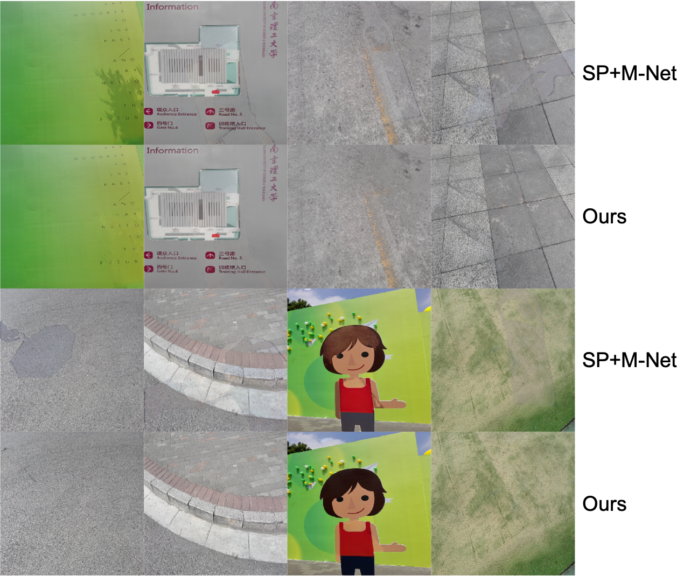

# Auto-exposure fusion for single-image shadow removal
We propose a new method for effective shadow removal by regarding it as an exposure fusion problem. Please refer to the paper for details: https://openaccess.thecvf.com/content/CVPR2021/papers/Fu_Auto-Exposure_Fusion_for_Single-Image_Shadow_Removal_CVPR_2021_paper.pdf.


## Dataset

- ISTD [ISTD](https://github.com/DeepInsight-PCALab/ST-CGAN)
- ISTD+ [ISTD+](https://github.com/cvlab-stonybrook/SID)
- SRD

1. For data folder path (ISTD), train_A: shadow images, train_B: shadow masks, train_C: shadow free images, organize them as following:

```shell
--ISTD+
   --train
      --train_A
          --1-1.png
      --train_B
          --1-1.png 
      --train_C_fixed_official 
          --1-1.png
      --train_params_fixed  # generate later
          --1-1.png.txt
   --test
      --test_A
          --1-1.png
      --test_B
          --1-1.png
      --test_C
          --1-1.png
      --mask_threshold   # generate later
          --1-1.png
 ```
 
 2. Run the code  `./data_processing/compute_params.ipynb` for exposure parameters generation. 
    The result will be put in `./ISTD/train/train_params_fixed`.
    Here, names `train_C_fixed_official` and `train_params_fixed` are for ISTD+ dataset, which are consitent with `self.dir_C` and `self.dir_param` in                 `./data/expo_param_dataset.py` .
 3. For testing masks, please run the code `./data_processing/test_mask_generation.py`. 
    The result will be put in `./ISTD/mask_threshold`.


## Pretrained models

We release our pretrained model (ISTD+, SRD) at [models](https://drive.google.com/drive/folders/1riTtYvHpffYu-nqSizqSF4fhbZ2txrp5?usp=sharing)

pretrained model (ISTD) at [models](https://drive.google.com/drive/folders/1qECA9EjUSLMtUpN5fFZMjltQPzjp2gL9?usp=sharing)

Modify the parameter `model` in file `OE_eval.sh` to `Refine` and set `ks=3, n=5, rks=3` to load the model.

## Train

Modify the corresponding path in file `OE_train.sh` and run the following script

```shell
sh OE_train.sh
```
1. For the parameters:
```shell
      DATA_PATH=./Datasets/ISTD or your datapath
      n=5, ks=3 for FusionNet,
      n=5, ks=3, rks=3 for RefineNet.
      model=Fusion for FusionNet training,
      model=Refine for RefineNet training.
 ```
 
   The trained models are saved in `${REPO_PATH}/log/${Name}`, `Name` are customized for parameters setting.

## Test

In order to test the performance of a trained model, you need to make sure that the hyper parameters in file `OE_eval.sh` match the ones in `OE_train.sh` and run the following script:

```shell
sh OE_eval.sh
```
1. The pretrained models are located in `${REPO_PATH}/log/${Name}`.

## Evaluation
The results reported in the paper are calculated by the `matlab` script used in other SOTA, please see [evaluation](https://drive.google.com/file/d/1SAMqLy3dSONPgeC5ZQskPoeq60FEx9Vk/view?usp=sharing) for details. Our evaluation code will print the metrics calculated by `python` code and save the shadow removed result images which will be used by the `matlab` script.

## Results

- Comparsion with SOTA, see paper for details.


- Penumbra comparsion between ours and SP+M Net



- Testing result

The testing results on dataset ISTD+, ISTD, SRD are:[results](https://drive.google.com/drive/folders/1ubLj5r_ZMzWew4h2bNX7pQL6D62mM-dl?usp=sharing)


**More details are coming soon**

## Bibtex

```
@inproceedings{fu2021auto,
      title={Auto-exposure Fusion for Single-image Shadow Removal}, 
      author={Lan Fu and Changqing Zhou and Qing Guo and Felix Juefei-Xu and Hongkai Yu and Wei Feng and Yang Liu and Song Wang},
      year={2021},
      booktitle={accepted to CVPR}
}
```
